The website is designed to help users find and contribute to a public map of destinations and picnic spots. Users can add new spots to the map, but each addition requires approval from an admin before it becomes publicly visible.

Key features of the website include:

1. User Registration and Authentication: Users can create an account and log in to access the website's features.

2. Map Integration: The website includes a map that displays existing destinations and picnic spots. Users can interact with the map, zoom in/out, and explore different locations.

3. Spot Submission: Registered users can submit new destination or picnic spots by providing relevant details such as name, description, location coordinates, and any additional information.

4. Admin Approval Process: Once a user submits a new spot, it goes into a pending state and awaits approval from an admin. The admin reviews the submission and can approve or reject it. Approved spots become visible on the public map.

5. Search and Filtering: Users can search for specific spots by name, location, or other criteria. They can also apply filters to refine their search results based on categories, ratings, or other attributes.

6. User Interaction: Users can rate and review existing spots, helping others make informed decisions. They can also suggest edits or updates to spot information.

7. Mobile Responsiveness: The website is designed to be responsive and accessible across various devices, ensuring a seamless user experience on mobile phones, tablets, and desktops.

8. User Profile: Each user has a profile page where they can view and manage their submitted spots, reviews, and other relevant information.

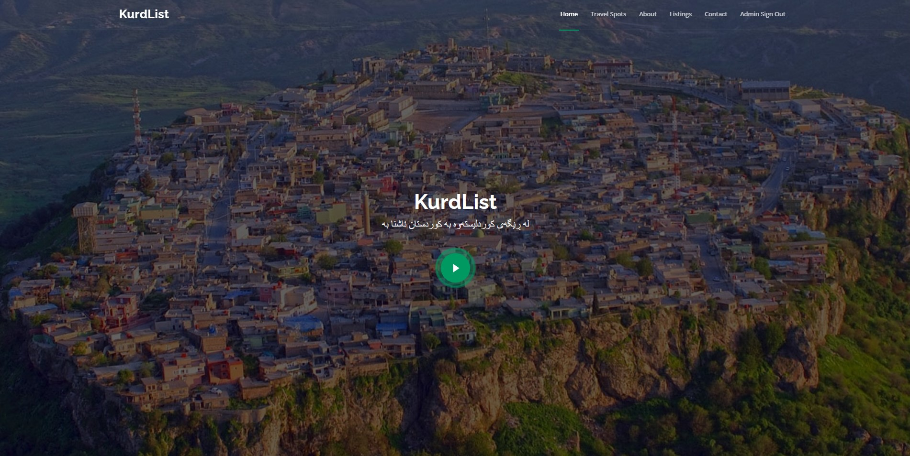

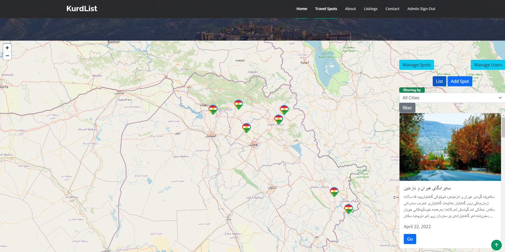

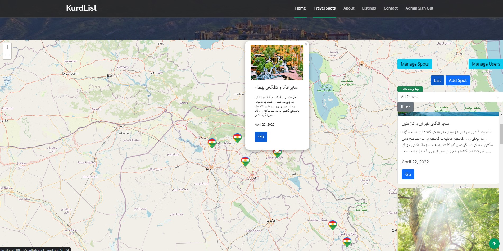

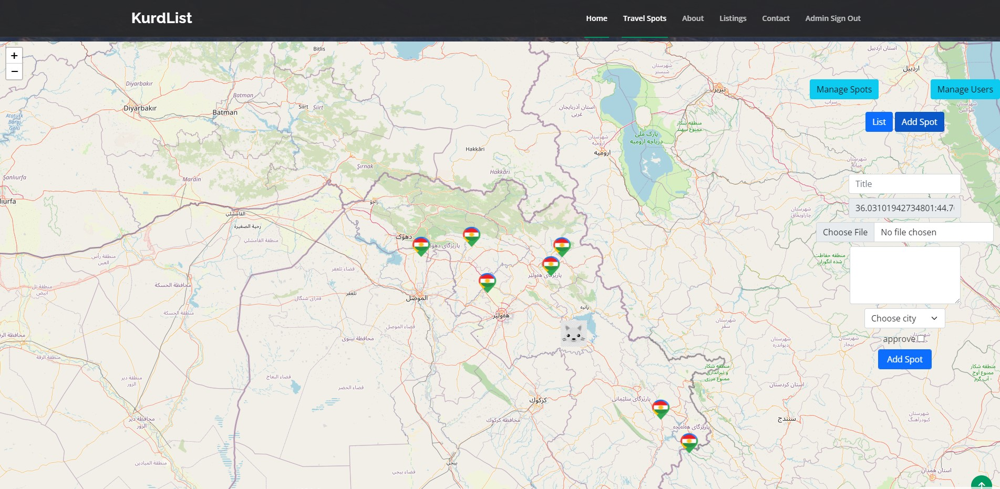

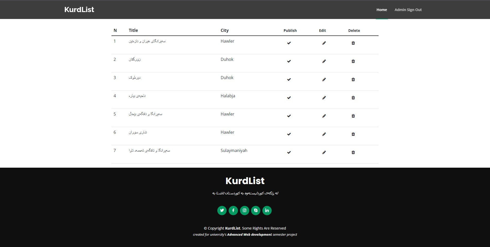

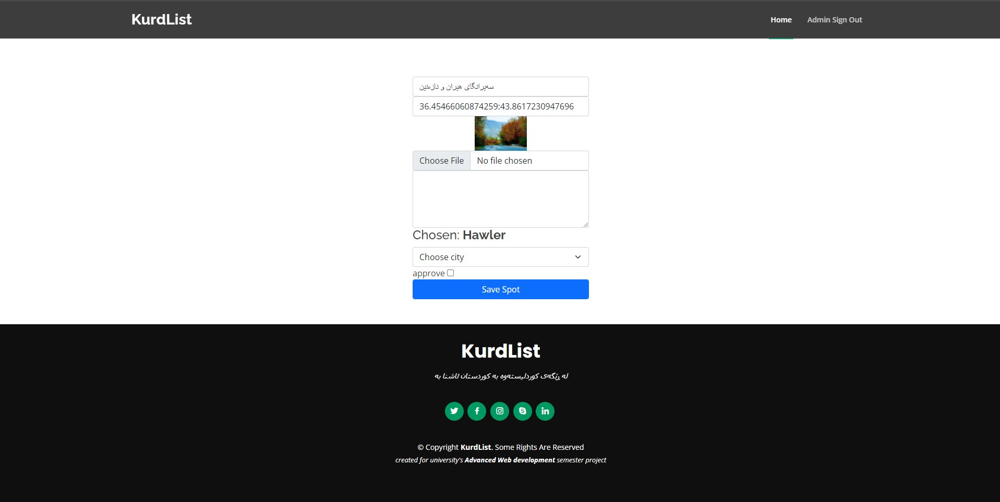

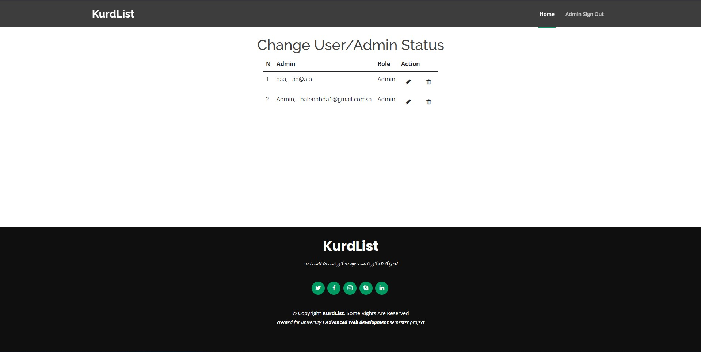
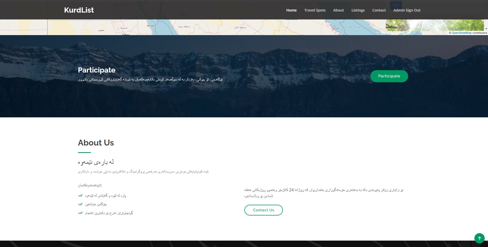

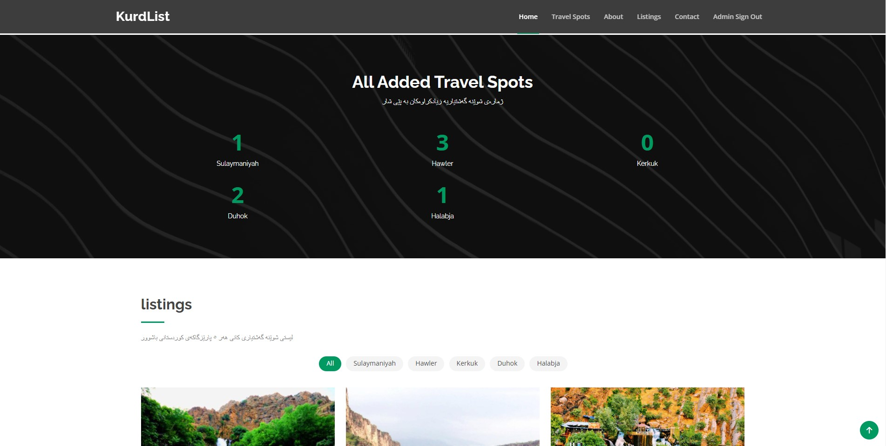
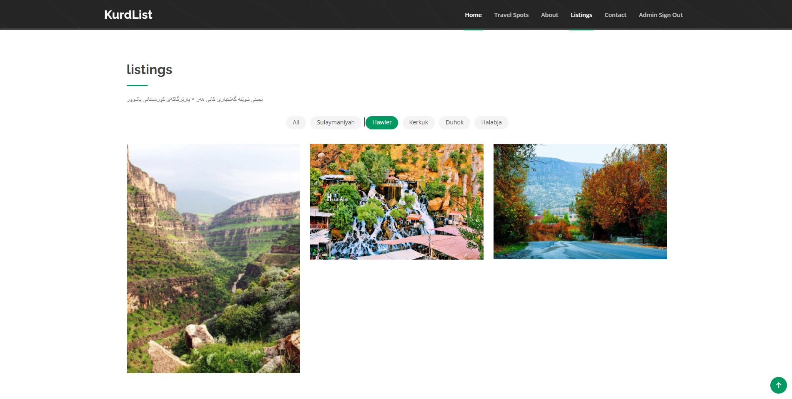
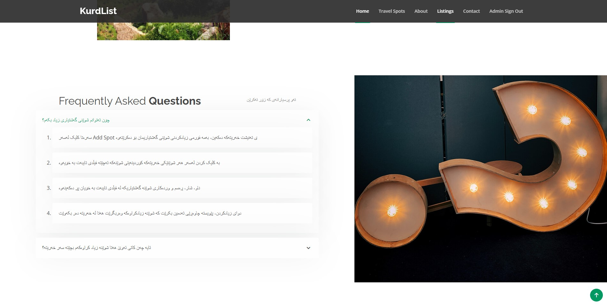
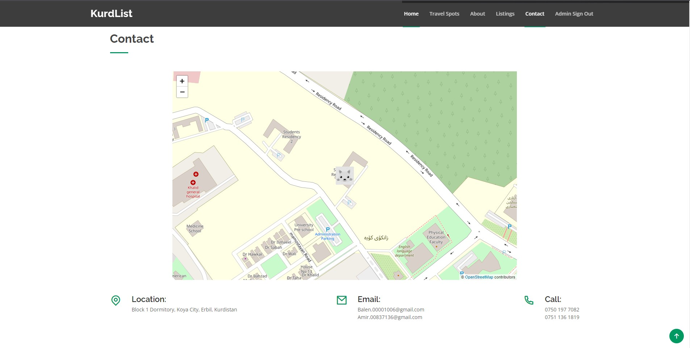
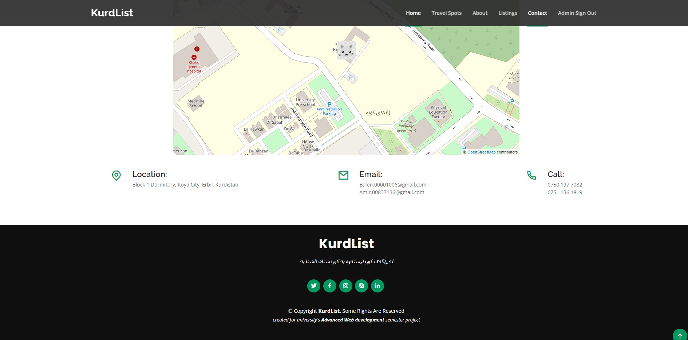

