Third stage web development mobile responsive website made using PHP/mySQl.
The idea behind this webiste is to help everyone find and add destination/picnic spots to a public map, each addition will need admin's approval to be public.

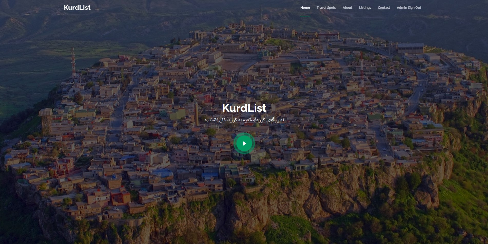

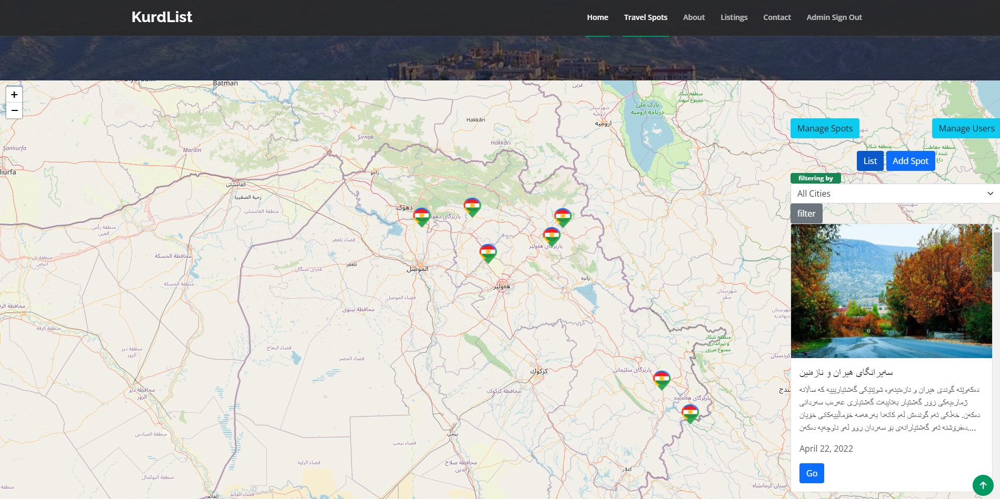

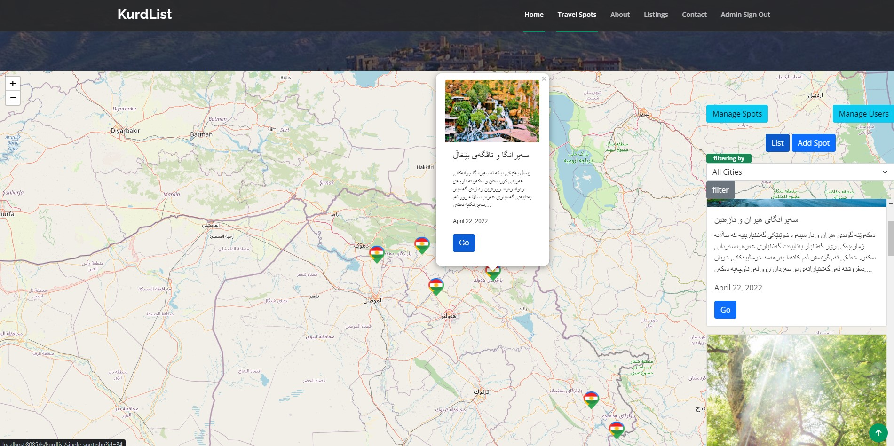

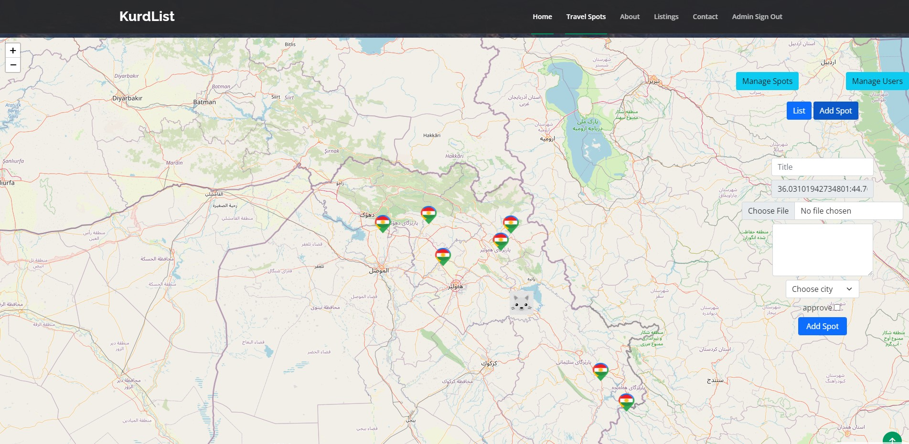

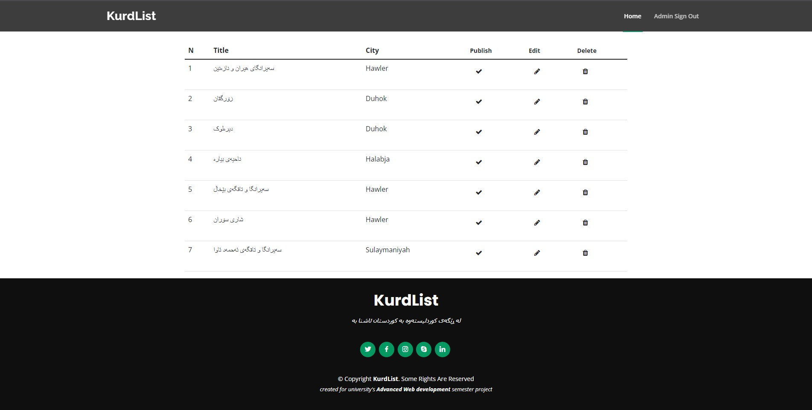

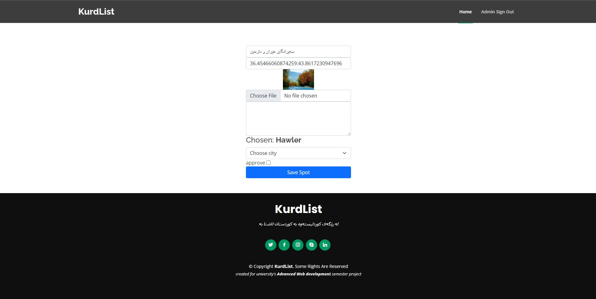

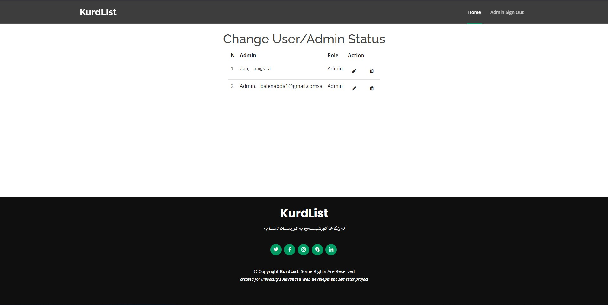
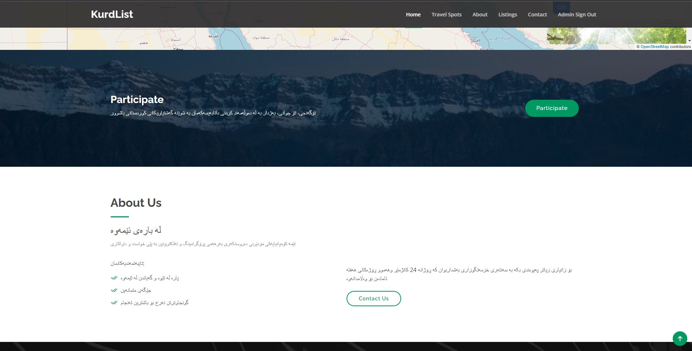

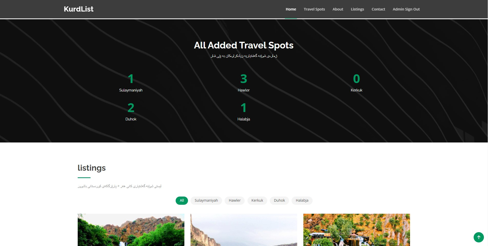
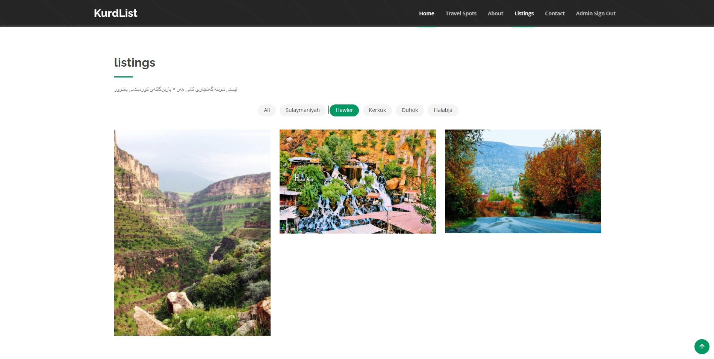
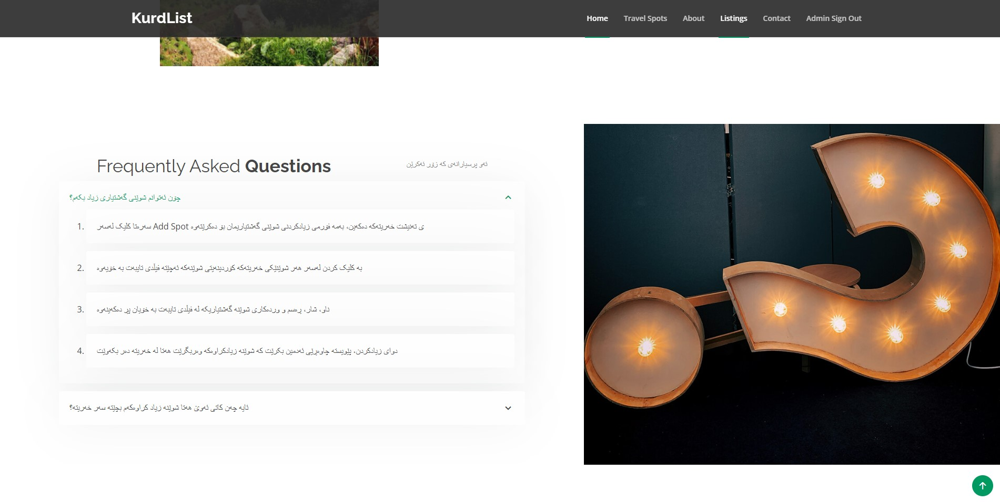
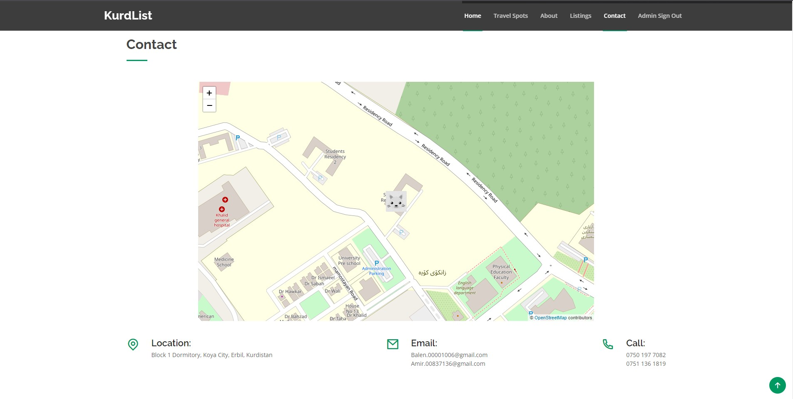
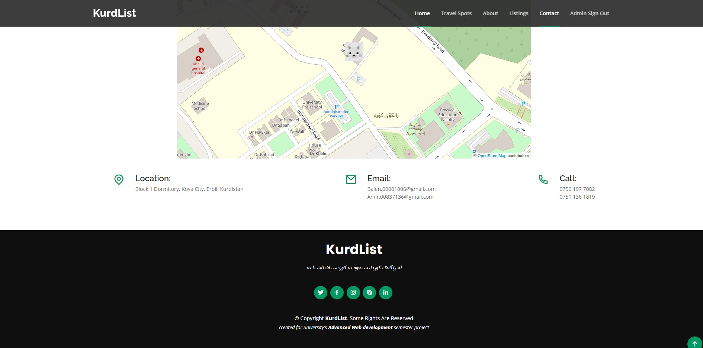

