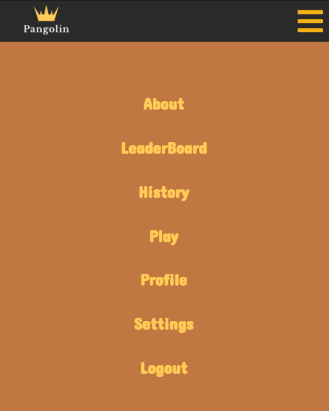
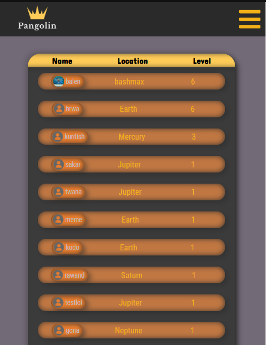
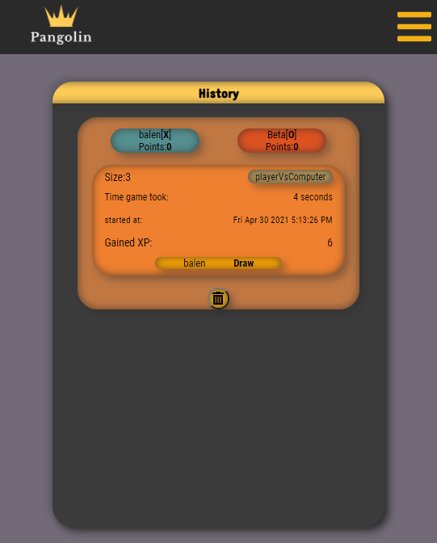
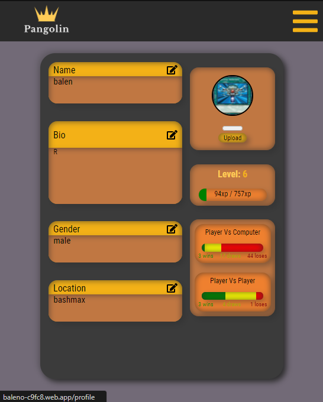
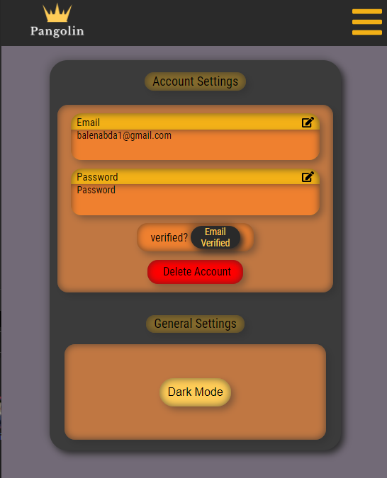
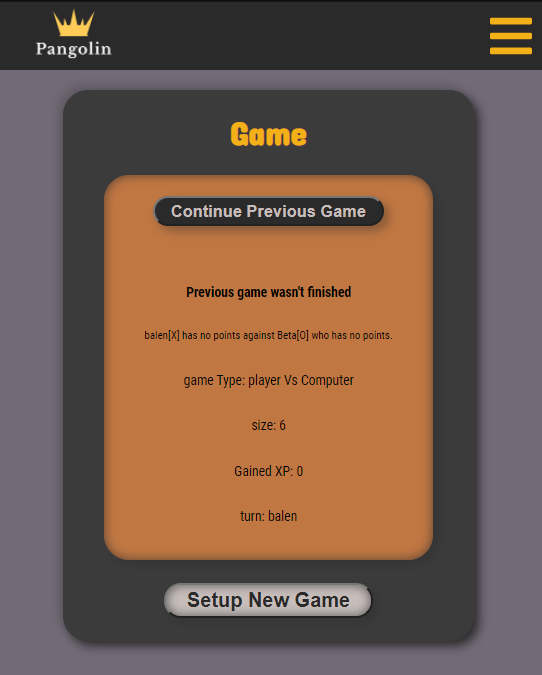
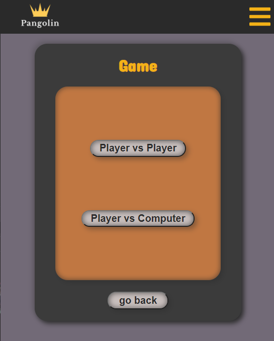
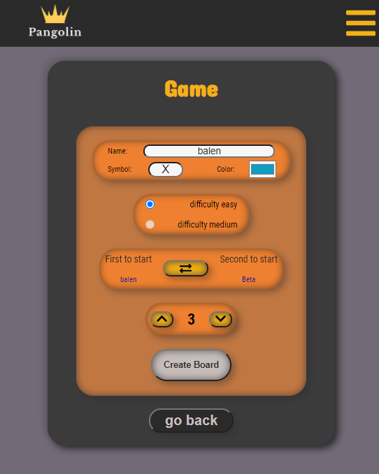

An alternative version of Tic-Tac-Toe where users can create accounts, have profiles with levels, and play games against a computer or another person. Players can customize the board size and many other features. The game is created using React, Sass CSS, and Firebase.

https://baleno-c9fc8.web.app/
One has to create an account to be able to play.

 

   
Mobile Responsive
 

