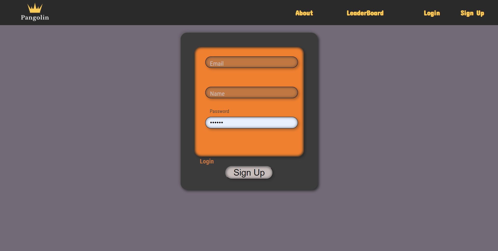
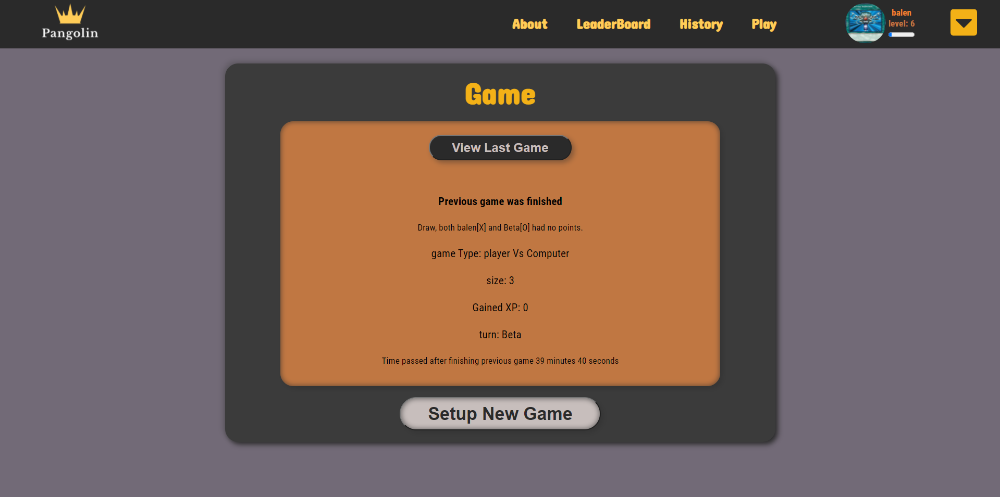
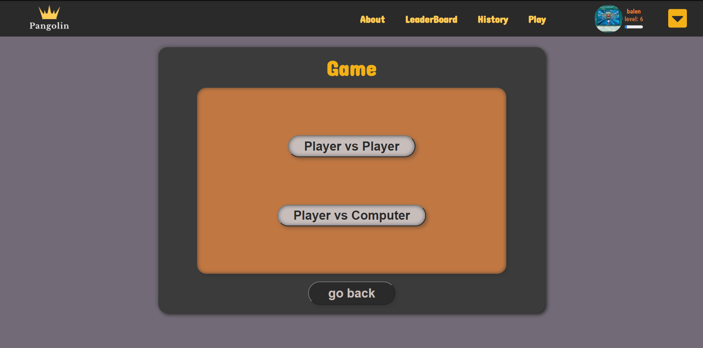
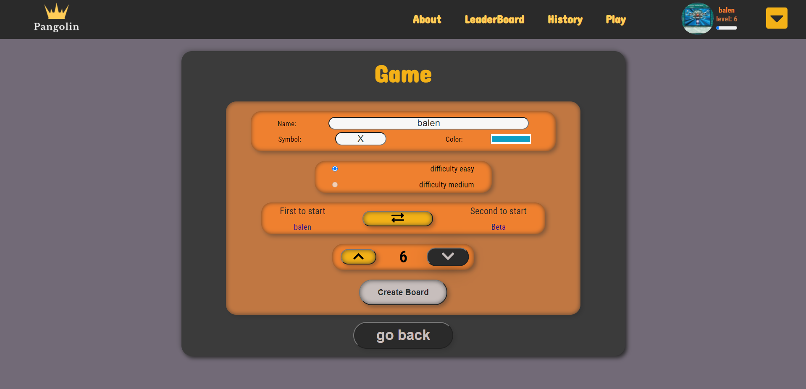
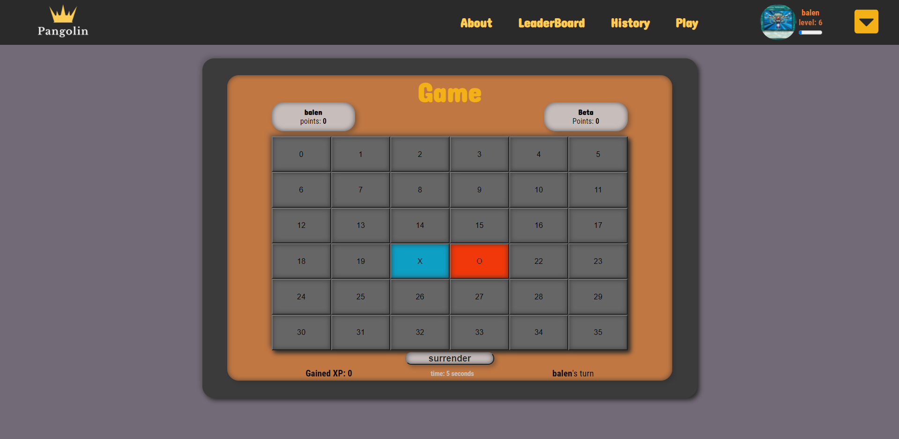
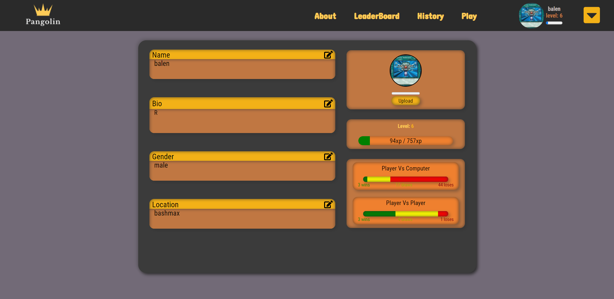
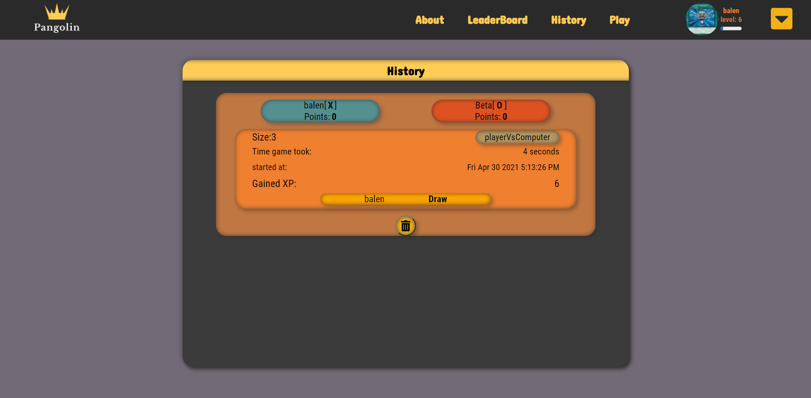
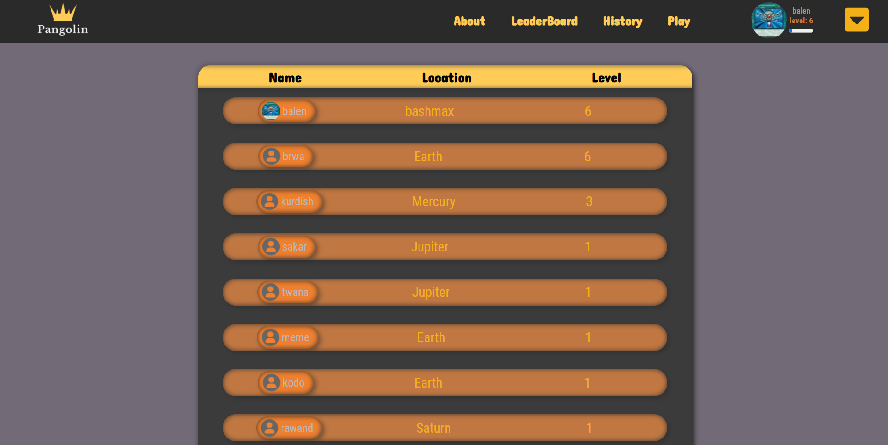

An Alternative version of Tic-Tac-Toe. Where one can create accounts, have profiles with levels and play games against a computer or another person next to them.
Board size and many other features could be customized by the players.
Created using React, sassy CSS, and firebase.

https://baleno-c9fc8.web.app/
One has to create an account to be able to play.

